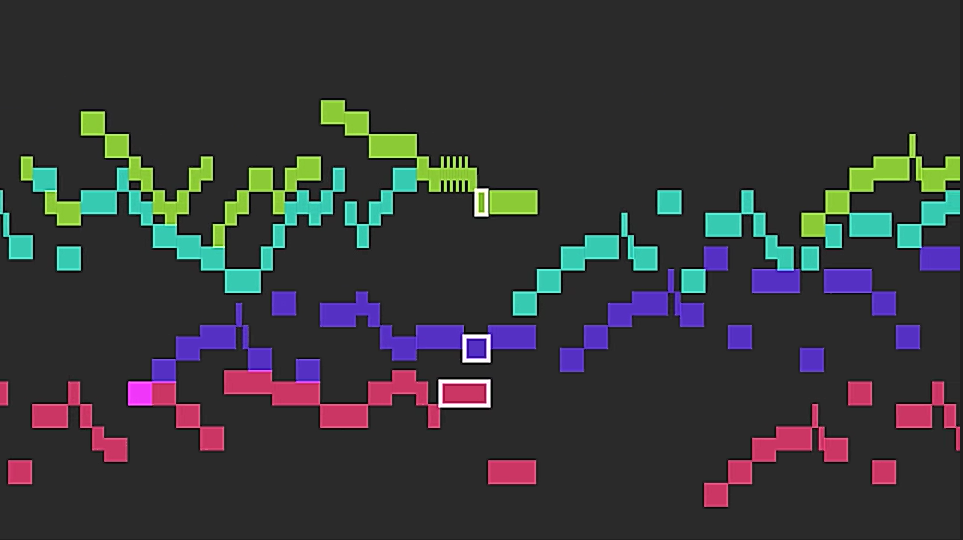

# MIDI-Visualizer

A simple MIDI Visualizer written in Processing.



## Usage

The MIDI visualizer will display a visualization of the MIDI file each frame. 

### Controls
If a MIDI file is specified (more on that in the next section), the program will start the visualization on its own and exit once the end of the MIDI file has been reached.
The space bar can be pressed to end the visualization early; if the sketch is in render mode, the video output will visualize the file up to the time the key was pressed
Pressing enter will save the current frame to the sketch folder

### User settings
The following settings can be adjusted by the user to fit their needs. These are changed using variables at the top of the sketch file.
- `renderMode`: if set to `true`, the visualizer will write to a video file in the sketch folder (and will not play audio during a sketch); it may render faster or slower than in real time. Otherwise, the visualizer will attempt to draw and play the MIDI in real time.
- `textMode`: if set to `true`, text labels will accompany each note in the visualization
- `fifthsMode`: if set to true, notes will be colored based on their position around the circle of fifths (adjacent notes will have similar colors). Otherwise, the notes will be colored based on which voice they belong to.
- `TPP`: controls how many MIDI ticks correspond to one pixel. Higher values lead to a visualization that moves more slowly across the screen
- 'fps': controls the frames per second (more applicable when `renderMode` is false)
- `backgroundColor`: controls the background color of the visualization

The dimensions of the sketch window can also be changed by the user as the visualizer will compensate to the width and height of the window. However, processing will not let the width and height be bound to a variable, so the user must edit the `size` call directly in the setup block.

### I/O and dependencies
The following are file paths to software and files that the sketch requires to run.
- `midiPath`: the path to the MIDI file to be rendered
- `fluidSynthExecutablePath`: the path to the installation of FluidSynth on the user's machine. FluidSynth is a synthesizer that the visualizer uses to generate audio in render mode. More information about FluidSynth [here](https://www.fluidsynth.org/).
- `audioOutputPath`: the path where the audio generated from the MIDI file should be stored. This can be deleted once the visualization has rendered
- `soundFontPath`: the path to the soundfont library that FluidSynth uses. I personally use the Nice Steinway Lite v3.0 sounfont library, which can be downloaded from [Soundfonts4u](https://sites.google.com/site/soundfonts4u/)

In addition, the sketch uses the Video Export processing library, which must be installed before running.

### Running from the command line

For more intensive projects, it may be more efficient to run the sketch from the command line in order to take advantage of scripting. To run a processing sketch from the command line, [add Processing to your PATH](https://marketplace.visualstudio.com/items?itemName=Tobiah.language-pde#add-processing-to-path), then run the following command on windows:

```Bash
processing-java --sketch=C:\Path\To\Sketch.pdf --run C:\Path\To\MIDI\File
```

### Note: Tempo Data
At the moment, the visualizer does not account for changes in tempo data. As such, if the MIDI file contains tempo changes, the visualization will become unsynchronized from the audio. The current fix is to use a [MIDI Editor](http://www.midieditor.org/) to remove the tempo data from the file.
